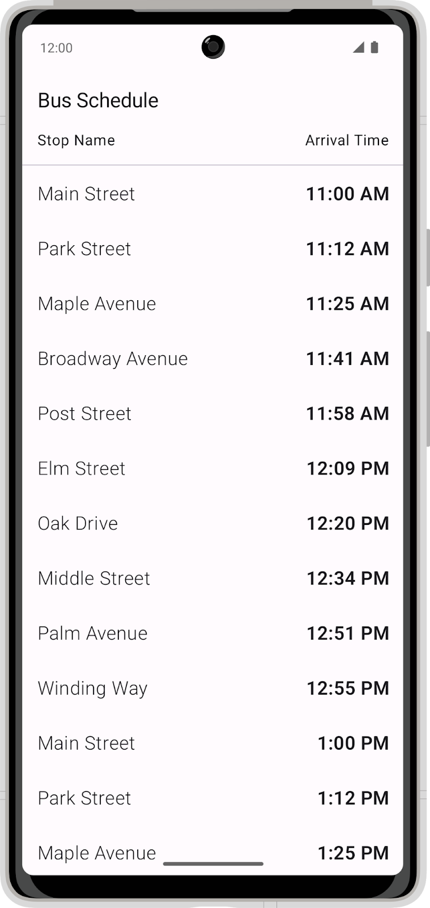
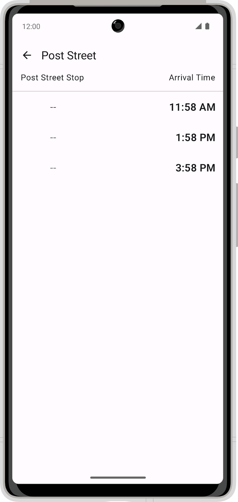
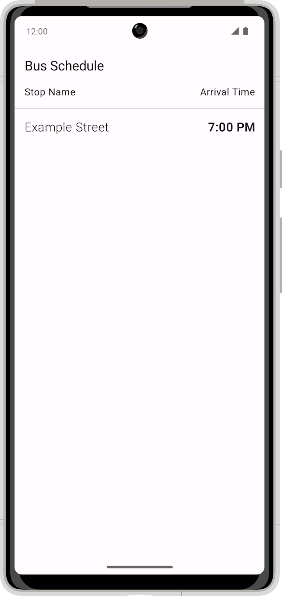
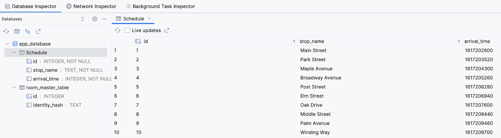

# 练习：构建 Bus Schedule 应用

> 本文根据 Bus Schedule 练习页面整理为本地参考版。外部代码入口和答案入口已省略，实验以 `../basic-android-kotlin-compose-training-bus-schedule/` 中的起始项目为准。

---

## 1. 前言

在“使用 Room 持久保留数据”相关学习中，你已经了解了如何在 Android 应用中实现 Room 数据库。本练习用于进一步熟悉 Room 数据库的实现方式。

本练习要求完成一个 Bus Schedule 应用。应用使用 Room 数据库提供的数据，向用户显示公交车站列表和计划发车时间。

完成后，应用应能：

- 从本地 Room 数据库加载公交时刻表
- 显示完整时刻列表
- 点击某个站点后显示该站点的所有到站时间
- 使用现有 Compose UI 和导航结构展示数据

---

## 2. 前提条件

- 已完成 Room 基础学习
- 能够在 Android Studio 中打开并运行项目
- 了解 Kotlin Flow、ViewModel 和 Compose 状态收集
- 了解 SQL 查询中的 `SELECT`、`WHERE` 和 `ORDER BY`

---

## 3. 将要构建的内容

起始代码中已经包含：

- Compose UI
- 顶部应用栏
- 完整时刻表页面
- 单个站点时刻页面
- 页面导航
- `assets/database/bus_schedule.db` 预置数据库

需要补全的是 Room 数据层。完成后，应用会从数据库中加载真实数据，而不是显示 ViewModel 中的示例数据。

完整时刻表示例：



站点详情示例：



起始代码运行时只显示示例数据：



---

## 4. 添加 Room 依赖项

在 app 模块中添加 Room 运行时、Room KTX 和 Room 编译器依赖：

```kotlin
implementation("androidx.room:room-ktx:${rootProject.extra["room_version"]}")
implementation("androidx.room:room-runtime:${rootProject.extra["room_version"]}")
ksp("androidx.room:room-compiler:${rootProject.extra["room_version"]}")
```

在项目级 Gradle 文件中添加 Room 版本号：

```kotlin
set("room_version", "2.7.0")
```

---

## 5. 创建 Room Entity

将当前的 `BusSchedule` 数据类转换为 Room Entity。

数据库表结构如下：

```sql
CREATE TABLE Schedule(
  id INTEGER NOT NULL,
  stop_name TEXT NOT NULL,
  arrival_time INTEGER NOT NULL,
  PRIMARY KEY (id)
);
```

最终 Entity 需要匹配这张表：



映射关系：

| Kotlin 属性 | 数据库列 |
|------------|----------|
| `id` | `id` |
| `stopName` | `stop_name` |
| `arrivalTimeInMillis` | `arrival_time` |

---

## 6. 创建数据访问对象

创建 DAO 来访问数据库。

DAO 应提供两类数据：

- 完整公交时刻表
- 指定公交站点的时刻表

查询要求：

```sql
SELECT * FROM Schedule ORDER BY arrival_time ASC
```

```sql
SELECT * FROM Schedule
WHERE stop_name = :stopName
ORDER BY arrival_time ASC
```

返回值建议使用：

```kotlin
Flow<List<BusSchedule>>
```

这样数据库数据变化时，UI 可以通过 Flow 获得新的列表。

---

## 7. 创建数据库实例

创建一个使用 `BusSchedule` Entity 和 `BusScheduleDao` 的 Room 数据库。

关键点：

- 数据库类继承 `RoomDatabase`
- 使用 `@Database(entities = [BusSchedule::class], version = 1, exportSchema = false)`
- 提供 `abstract fun busScheduleDao(): BusScheduleDao`
- 使用单例模式避免重复创建数据库
- 使用 `createFromAsset("database/bus_schedule.db")` 载入预置数据库

`createFromAsset()` 的路径是相对于 `app/src/main/assets/` 的路径，因此这里写：

```kotlin
createFromAsset("database/bus_schedule.db")
```

---

## 8. 更新 ViewModel

起始代码的 ViewModel 当前返回示例数据：

```kotlin
fun getFullSchedule(): Flow<List<BusSchedule>> = flowOf(...)
fun getScheduleFor(stopName: String): Flow<List<BusSchedule>> = flowOf(...)
```

完成 Room 数据层后，需要让 ViewModel 调用 DAO：

```kotlin
fun getFullSchedule(): Flow<List<BusSchedule>> = busScheduleDao.getAll()

fun getScheduleFor(stopName: String): Flow<List<BusSchedule>> =
    busScheduleDao.getByStopName(stopName)
```

ViewModel 的 factory 可以通过 Application Context 创建数据库实例，再把 DAO 传入 ViewModel。

---

## 9. 运行检查

运行应用后，应确认：

- 首页不再显示 `Example Street`
- 首页显示数据库中完整时刻表
- 数据按到站时间排序
- 点击站点可以进入详情页
- 详情页只显示该站点对应时刻
- 返回按钮行为正常

如果应用无法读取数据，优先检查：

- Room 依赖是否添加完整
- Entity 表名是否为 `Schedule`
- `@ColumnInfo` 中的列名是否为 `stop_name` 和 `arrival_time`
- `createFromAsset()` 路径是否为 `database/bus_schedule.db`
- ViewModel 是否仍在使用 `flowOf()` 示例数据

---
